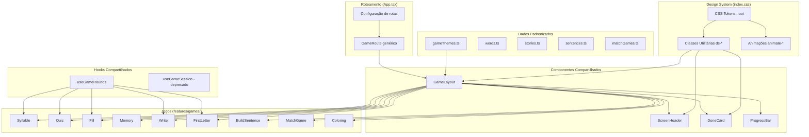
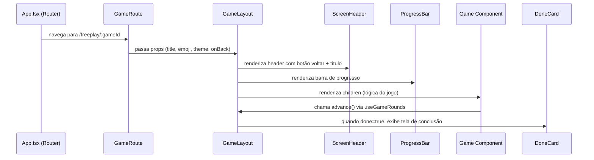

# Design — Padronização do App DigiLetras

## Visão Geral

Este documento descreve o design técnico para padronizar o app DigiLetras, eliminando duplicação de código, centralizando estilos no design system existente, e criando componentes compartilhados que unifiquem a experiência visual e a arquitetura dos 9 jogos educativos.

A abordagem é incremental: cada mudança pode ser aplicada isoladamente sem quebrar funcionalidade existente. O design system CSS já existe em `index.css` com tokens e classes utilitárias (`ds-btn`, `ds-card`, `ds-screen`, etc.) — o trabalho principal é **adotar** esses tokens nos componentes que ainda usam estilos inline, e criar componentes de layout compartilhados para eliminar duplicação.

### Decisões de Design

1. **CSS-first, não CSS-in-JS**: Manter a abordagem atual de classes CSS + Tailwind, expandindo os tokens em `index.css` em vez de introduzir uma biblioteca de estilos.
2. **Composição sobre herança**: `GameLayout` e `ScreenHeader` são componentes de composição via `children`, não HOCs.
3. **Migração incremental**: Cada jogo pode ser migrado individualmente — o `GameLayout` é opt-in, não obrigatório.
4. **Tipagem derivada**: `GameId` é derivado de `gameThemes.ts` via `as const`, eliminando sincronização manual.
5. **fast-check para PBT**: O projeto já usa `fast-check` — continuaremos com ele para testes de propriedade.

## Arquitetura



### Fluxo de Renderização de um Jogo



## Componentes e Interfaces

### 1. ScreenHeader

Componente de header reutilizável para todas as telas do app (jogos, freeplay, admin).

```typescript
interface ScreenHeaderProps {
  title: string;
  emoji: string;
  onBack: () => void;
  /** Cores do gradiente de fundo. Default: var(--gradient-primary) */
  gradient?: string;
  /** Subtítulo opcional abaixo do título */
  subtitle?: string;
  /** Ações extras à direita (ReactNode) */
  actions?: React.ReactNode;
}
```

**Implementação**:
- Header `<header>` com `position: sticky`, `top: 0`, `z-index: 10`
- Botão voltar usando classe `ds-btn-icon` com `aria-label="Voltar"` e min 44x44px
- Título com emoji + texto usando tokens de tipografia do DS
- Sombra via `var(--shadow-md)`
- Gradiente configurável via prop, default `var(--gradient-primary)`

### 2. GameLayout

Wrapper de composição que fornece a estrutura visual padrão de todos os jogos.

```typescript
interface GameLayoutProps {
  /** ID do jogo para buscar tema em gameThemes.ts */
  gameId: string;
  onBack: () => void;
  /** Estado atual da rodada */
  currentRound: number;
  totalRounds: number;
  /** Se true, exibe DoneCard em vez de children */
  done: boolean;
  /** Pontuação para o DoneCard */
  score?: { correct: number; total: number };
  /** Callback para botão "Próximo" no DoneCard */
  onNext?: () => void;
  children: React.ReactNode;
}
```

**Implementação**:
- Usa `getTheme(gameId)` para obter cores do tema
- Renderiza `ScreenHeader` com emoji, label e gradient do tema
- Renderiza `ProgressBar` com cor do tema
- Quando `done=true`, renderiza `DoneCard` com score
- Wrapper com classe `ds-screen` e gradiente do tema como fundo
- Children recebem a área de conteúdo principal

### 3. GameRoute (Componente Genérico de Rota)

Elimina os 9 route wrappers duplicados em `App.tsx`.

```typescript
/** Registro de configuração de rota de jogo */
interface GameRouteConfig {
  id: string;
  component: React.ComponentType<GameComponentProps>;
  /** Se true, não passa wordPool (ex: BuildSentence, MatchGame, Coloring) */
  noWordPool?: boolean;
}

/** Props padrão que todo Game Component recebe */
interface GameComponentProps {
  onBack: () => void;
  wordPool?: Word[];
  rounds?: number;
  onComplete?: (errors: number) => void;
}

/** Componente genérico que conecta Router → Game */
function GameRoute({ config }: { config: GameRouteConfig }) {
  const nav = useNavigate();
  const { state } = useLocation() as { state: GameState | null };
  const Component = config.component;
  
  return (
    <Component
      onBack={() => nav('/freeplay')}
      wordPool={config.noWordPool ? undefined : state?.wordPool}
    />
  );
}
```

**Uso em App.tsx**:
```typescript
const GAME_ROUTES: GameRouteConfig[] = [
  { id: 'syllable', component: Syllable },
  { id: 'quiz', component: Quiz },
  { id: 'fill', component: Fill },
  // ...
  { id: 'buildsentence', component: BuildSentence, noWordPool: true },
  { id: 'matchgame', component: MatchGame, noWordPool: true },
  { id: 'coloring', component: Coloring, noWordPool: true },
];

// Na definição do router:
...GAME_ROUTES.map(config => ({
  path: `/freeplay/${config.id}`,
  element: <GameRoute config={config} />,
})),
```

### 4. useGameRounds Hook

Substitui o padrão duplicado de gerenciamento de rodadas presente em Syllable, Quiz, Fill, Write, FirstLetter.

```typescript
interface UseGameRoundsOptions<T> {
  /** Pool de itens para as rodadas */
  pool: T[];
  /** Número total de rodadas */
  totalRounds: number;
  /** Callback quando todas as rodadas terminam */
  onComplete?: (errors: number) => void;
}

interface UseGameRoundsReturn<T> {
  /** Item atual da rodada */
  current: T | undefined;
  /** Índice da rodada atual (0-based) */
  round: number;
  /** Contagem de acertos */
  correct: number;
  /** Contagem de erros */
  errors: number;
  /** Se todas as rodadas foram completadas */
  done: boolean;
  /** Avança para próxima rodada. Retorna { finished, errors } */
  advance: (isCorrect: boolean) => { finished: boolean; errors: number };
  /** Incrementa contador de erros sem avançar rodada */
  addError: () => void;
}

function useGameRounds<T>(options: UseGameRoundsOptions<T>): UseGameRoundsReturn<T>
```

**Diferença do `useGameSession` existente**:
- Genérico (`<T>` em vez de fixo em `Word`)
- Aceita `onComplete` callback diretamente
- Não faz shuffle internamente (o caller passa o pool já preparado)
- O `useGameSession` existente será marcado como deprecated e migrado gradualmente

### 5. Classes de Feedback Visual

Novas classes CSS no design system para feedback de acerto/erro:

```css
/* Feedback de acerto */
.ds-feedback-correct {
  background-color: #C8E6C9;
  border-color: var(--color-success);
  color: #2E7D32;
}

/* Feedback de erro */
.ds-feedback-wrong {
  background-color: #FFCDD2;
  border-color: var(--color-danger);
  color: #C62828;
}
```

### 6. Tokens Adicionais no Design System

Tokens que faltam no `index.css` atual:

```css
:root {
  /* Espaçamento */
  --spacing-xs: 4px;
  --spacing-sm: 8px;
  --spacing-md: 16px;
  --spacing-lg: 24px;
  --spacing-xl: 32px;
  --spacing-2xl: 48px;

  /* Transições */
  --transition-fast: 0.15s ease;
  --transition-normal: 0.3s ease;
}
```

### 7. Tipo GameId Derivado

```typescript
// Em gameThemes.ts
export const GAME_THEMES = [ ... ] as const;

export type GameId = (typeof GAME_THEMES)[number]['id'];
// Resulta em: 'syllable' | 'quiz' | 'fill' | 'memory' | ...
```

Também adicionar `gradient` e `textColor` à interface `GameTheme`:

```typescript
export interface GameTheme {
  id: string;
  icon: string;
  label: string;
  color: string;
  bg: string;
  gradient: string;    // ex: 'linear-gradient(135deg, #e1bee7, #ce93d8)'
  textColor: string;   // ex: '#7B1FA2'
}
```

## Modelos de Dados

### Padronização de Interfaces

As interfaces de dados já existem mas precisam de ajustes para consistência:

#### Word (já padronizada)
```typescript
interface Word {
  id: string;        // prefixo 'w-' (migrar de IDs numéricos)
  word: string;
  syllables: string[];
  difficulty: 1 | 2 | 3;
  category: string;
  emoji: string;
  silabicFamily?: string;
}
```

#### Story (ajustar campo theme)
```typescript
interface Story {
  id: string;        // prefixo 's-' (já usa)
  title: string;
  emoji: string;
  sentences: string[];
  difficulty: 1 | 2 | 3;
  theme: string;     // tornar obrigatório (remover ?)
}
```

#### Sentence (adicionar difficulty)
```typescript
interface Sentence {
  id: string;        // prefixo 'f-' (já usa)
  text: string;
  words: string[];
  difficulty: 1 | 2 | 3;  // NOVO — atualmente não existe
}
```

#### MatchGame (renomear name→title, adicionar difficulty)
```typescript
interface MatchGame {
  id: string;        // prefixo 'mg-' para estáticos
  title: string;     // renomear de 'name'
  mode: MatchType;   // renomear de 'type' (evitar conflito com keyword)
  pairs: MatchPair[];
  difficulty: 1 | 2 | 3;  // NOVO
  emoji: string;
  description: string;
  instructions: string;
  targetLetter?: string;
}
```

### Validação com `as const satisfies`

Para dados estáticos, usar o padrão:
```typescript
export const words = [
  { id: 'w-1', word: 'bola', ... },
  // ...
] as const satisfies readonly Word[];
```

Isso garante:
- Inferência de tipo literal (IDs como `'w-1'` em vez de `string`)
- Validação em tempo de compilação contra a interface
- Imutabilidade dos dados estáticos

### Organização de Pastas

```
shared/
├── components/
│   ├── layout/
│   │   ├── ScreenHeader.tsx
│   │   ├── GameLayout.tsx
│   │   └── index.ts
│   ├── feedback/
│   │   ├── DoneCard.tsx
│   │   ├── ProgressBar.tsx
│   │   └── index.ts
│   └── ui/
│       ├── Bubbles.tsx
│       ├── OnScreenKeyboard.tsx
│       └── index.ts
├── data/
│   ├── words.ts
│   ├── stories.ts
│   ├── sentences.ts
│   ├── matchGames.ts
│   ├── coloringSheets.ts
│   └── gameThemes.ts
├── hooks/
│   ├── useGameRounds.ts
│   ├── useGameSession.ts  (deprecated)
│   ├── useKeyboardInput.ts
│   └── useShake.ts
├── types.ts               (tipos compartilhados: GameId, GameComponentProps)
└── utils/
    ├── audio.ts
    ├── device.ts
    ├── helpers.ts
    └── sessionStats.ts
```


## Propriedades de Corretude

*Uma propriedade é uma característica ou comportamento que deve ser verdadeiro em todas as execuções válidas de um sistema — essencialmente, uma declaração formal sobre o que o sistema deve fazer. Propriedades servem como ponte entre especificações legíveis por humanos e garantias de corretude verificáveis por máquina.*

As propriedades abaixo foram derivadas dos critérios de aceitação dos requisitos, após análise de testabilidade e eliminação de redundâncias. Muitos critérios referem-se a padrões de código (uso de classes CSS, organização de arquivos) que são verificados por linting ou revisão de código, não por testes de propriedade. As propriedades abaixo focam nos comportamentos verificáveis em tempo de execução.

### Propriedade 1: GameLayout renderiza todos os elementos obrigatórios para qualquer tema

*Para qualquer* `gameId` válido presente em `GAME_THEMES`, quando o `GameLayout` for renderizado com `done=false`, o output deve conter: (a) um `ScreenHeader` com o emoji e label do tema correspondente, (b) um `ProgressBar` com a cor do tema, e (c) a área de conteúdo (children).

**Valida: Requisitos 2.1, 2.4**

### Propriedade 2: GameLayout exibe DoneCard quando concluído

*Para qualquer* configuração de jogo (gameId, score), quando o `GameLayout` for renderizado com `done=true`, o output deve conter o componente `DoneCard` com a pontuação correta e não deve renderizar os children do jogo.

**Valida: Requisito 2.3**

### Propriedade 3: ScreenHeader renderiza com estrutura e acessibilidade corretas

*Para qualquer* combinação válida de props (title, emoji, onBack), o `ScreenHeader` deve renderizar: (a) um botão de voltar com `aria-label="Voltar"` e dimensões mínimas de 44x44 pixels, (b) o título contendo o emoji e o texto, e (c) o gradiente de fundo aplicado.

**Valida: Requisitos 6.1, 6.4**

### Propriedade 4: GameRoute renderiza o componente correto com props corretas

*Para qualquer* configuração de rota em `GAME_ROUTES` e qualquer `wordPool` no estado de navegação, o `GameRoute` deve renderizar o componente de jogo correspondente ao `config.id`, passando `onBack` e `wordPool` (quando `noWordPool` é false) extraído do estado de navegação.

**Valida: Requisitos 4.1, 4.4**

### Propriedade 5: Módulos de dados possuem todos os campos obrigatórios e IDs com prefixo correto

*Para qualquer* item em qualquer módulo de dados (words, stories, sentences, matchGames), todos os campos obrigatórios definidos na interface correspondente devem estar presentes com tipos corretos, e o `id` deve começar com o prefixo correto para o tipo de dado (`w-` para words, `s-` para stories, `f-` para sentences, `mg-` para matchGames estáticos).

**Valida: Requisitos 5.1, 5.2, 5.3, 5.4, 5.6**

### Propriedade 6: GameThemes possuem todos os campos obrigatórios incluindo gradiente válido

*Para qualquer* tema em `GAME_THEMES`, os campos `id`, `icon`, `label`, `color`, `bg`, `gradient` e `textColor` devem estar presentes, e o campo `gradient` deve ser uma string CSS de gradiente válida (começando com `linear-gradient`).

**Valida: Requisitos 7.1, 7.4**

### Propriedade 7: useGameRounds gerencia progressão de rodadas corretamente

*Para qualquer* pool de itens e número total de rodadas, e qualquer sequência de chamadas `advance(isCorrect)`:
- `round` deve incrementar em 1 após cada `advance` com resultado correto até atingir `totalRounds`
- `correct` deve ser igual ao número de chamadas `advance(true)`
- `errors` deve ser igual ao número de chamadas `advance(false)` mais chamadas `addError()`
- `done` deve ser `true` somente quando `round + 1 >= totalRounds` após um `advance`
- `onComplete` deve ser chamado exatamente uma vez quando `done` se torna `true`

**Valida: Requisito 12.1**

### Propriedade 8: Elementos interativos possuem atributos de acessibilidade

*Para qualquer* componente de jogo renderizado, todos os botões que contêm apenas emoji ou ícone devem ter um atributo `aria-label` descritivo, e todos os containers de feedback visual (acerto/erro) devem ter `role="status"` e `aria-live="polite"`.

**Valida: Requisitos 13.1, 13.3**

### Propriedade 9: Combinações de cores dos temas atendem requisitos de contraste

*Para qualquer* tema em `GAME_THEMES`, a razão de contraste entre `textColor` e `bg` deve ser no mínimo 4.5:1 conforme WCAG AA.

**Valida: Requisito 13.4**

### Propriedade 10: getTheme retorna tema válido para qualquer GameId

*Para qualquer* `id` presente no array `GAME_THEMES`, a função `getTheme(id)` deve retornar o tema com o mesmo `id`. Para qualquer string que não seja um `id` válido, `getTheme` deve retornar o primeiro tema como fallback.

**Valida: Requisito 9.4**

## Tratamento de Erros

### Estratégia Geral

A padronização não introduz novos fluxos de erro significativos, mas deve preservar o comportamento existente:

| Cenário | Tratamento |
|---------|-----------|
| `getTheme(id)` com ID inválido | Retorna `GAME_THEMES[0]` como fallback (já implementado) |
| `GameRoute` sem `wordPool` no state | Passa `undefined` — cada jogo já tem fallback para `words` global |
| `useGameRounds` com pool vazio | `current` retorna `undefined`, componente deve tratar com early return |
| `useGameRounds.advance()` após `done=true` | Operação ignorada (no-op) |
| Dados estáticos com campos faltando | Erro de compilação via `as const satisfies` — detectado em build time |
| `ScreenHeader` sem `actions` | Área de ações não renderizada (prop opcional) |

### Princípios

1. **Fail-safe**: Componentes compartilhados devem ter fallbacks sensatos (cores default, temas default)
2. **Compile-time first**: Preferir detecção de erros em tempo de compilação via TypeScript strict + `satisfies`
3. **Preservar comportamento**: A migração não deve alterar o comportamento visível dos jogos existentes

## Estratégia de Testes

### Abordagem Dual

A estratégia combina testes unitários (exemplos específicos) e testes de propriedade (verificação universal):

- **Testes unitários (vitest)**: Verificam exemplos específicos, edge cases e integrações pontuais
- **Testes de propriedade (fast-check + vitest)**: Verificam propriedades universais com inputs gerados aleatoriamente

### Configuração de Testes de Propriedade

- **Biblioteca**: `fast-check` (já instalado no projeto)
- **Framework**: `vitest` (já configurado)
- **Iterações mínimas**: 100 por teste de propriedade
- **Tag de referência**: Cada teste deve incluir um comentário no formato:
  ```
  // Feature: app-standardization, Property {N}: {descrição}
  ```
- **Cada propriedade de corretude deve ser implementada por um ÚNICO teste de propriedade**

### Plano de Testes

#### Testes de Propriedade

| Propriedade | Arquivo de Teste | Gerador |
|-------------|-----------------|---------|
| P1: GameLayout elementos | `shared/components/__tests__/GameLayout.property.test.tsx` | Gerar `gameId` aleatório de `GAME_THEMES`, rounds e round aleatórios |
| P2: GameLayout DoneCard | `shared/components/__tests__/GameLayout.property.test.tsx` | Gerar score aleatório com `done=true` |
| P3: ScreenHeader estrutura | `shared/components/__tests__/ScreenHeader.property.test.tsx` | Gerar title, emoji, gradient aleatórios |
| P4: GameRoute props | `shared/components/__tests__/GameRoute.property.test.tsx` | Gerar config aleatória de `GAME_ROUTES` e wordPool |
| P5: Dados campos obrigatórios | `shared/data/__tests__/dataModules.property.test.ts` | Iterar sobre todos os itens de cada módulo |
| P6: GameThemes campos | `shared/data/__tests__/gameThemes.property.test.ts` | Iterar sobre todos os temas |
| P7: useGameRounds progressão | `shared/hooks/__tests__/useGameRounds.property.test.ts` | Gerar sequências aleatórias de advance(true/false) |
| P8: Acessibilidade | `shared/components/__tests__/accessibility.property.test.tsx` | Renderizar componentes com props aleatórias |
| P9: Contraste de cores | `shared/data/__tests__/gameThemes.property.test.ts` | Calcular contraste para cada tema |
| P10: getTheme fallback | `shared/data/__tests__/gameThemes.property.test.ts` | Gerar strings aleatórias como IDs |

#### Testes Unitários

| Cenário | Arquivo de Teste |
|---------|-----------------|
| ScreenHeader renderiza com props mínimas | `shared/components/__tests__/ScreenHeader.test.tsx` |
| GameLayout alterna entre jogo e DoneCard | `shared/components/__tests__/GameLayout.test.tsx` |
| useGameRounds: pool vazio retorna current undefined | `shared/hooks/__tests__/useGameRounds.test.ts` |
| useGameRounds: advance após done é no-op | `shared/hooks/__tests__/useGameRounds.test.ts` |
| getTheme com ID inexistente retorna fallback | `shared/data/__tests__/gameThemes.test.ts` |
| Dados: IDs não duplicados em cada módulo | `shared/data/__tests__/dataModules.test.ts` |
| GameRoute: componente sem wordPool recebe undefined | `shared/components/__tests__/GameRoute.test.tsx` |

### Estratégia de Migração

A migração é incremental e cada etapa pode ser verificada independentemente:

1. **Fase 1 — Tokens e Classes CSS**: Adicionar tokens faltantes ao `index.css`, criar classes de feedback. Zero impacto em componentes existentes.
2. **Fase 2 — Componentes Compartilhados**: Criar `ScreenHeader`, `GameLayout`, `useGameRounds`. Não alterar componentes existentes.
3. **Fase 3 — Migração de Jogos**: Migrar um jogo por vez para usar `GameLayout` + `useGameRounds`. Testes existentes devem continuar passando.
4. **Fase 4 — Dados e Rotas**: Padronizar interfaces de dados, migrar IDs, refatorar `App.tsx` para usar `GameRoute` genérico.
5. **Fase 5 — Organização de Pastas**: Mover arquivos para nova estrutura, atualizar imports.

Cada fase é independente e pode ser revertida sem afetar as demais.
