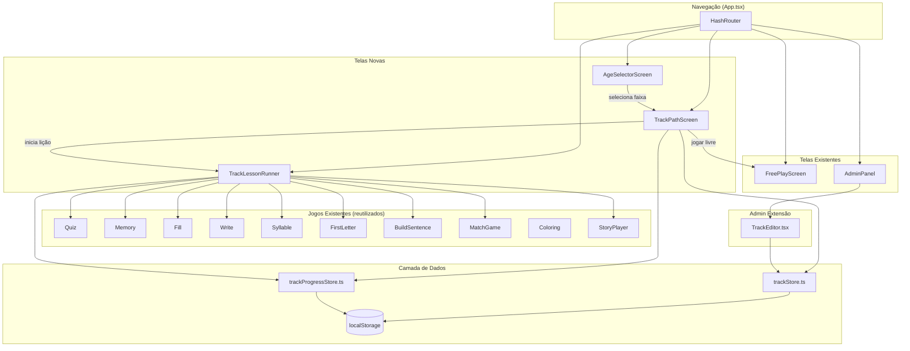
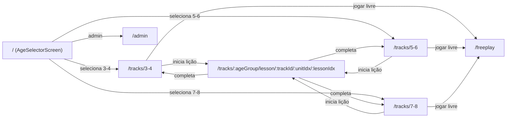

# Design — Trilhas de Aprendizado Gamificadas por Faixa Etária

## Visão Geral

Este design descreve a implementação do sistema de trilhas de aprendizado gamificadas para o DigiLetras, organizando jogos e atividades por faixa etária (3–4, 5–6, 7–8 anos). O sistema reutiliza os componentes de jogo existentes (Quiz, Memory, MatchGame, Fill, Write, Syllable, FirstLetter, BuildSentence, Coloring) e estende o painel administrativo para gerenciamento de trilhas.

A arquitetura segue os padrões já estabelecidos no projeto:
- Navegação via `react-router-dom` com `createHashRouter`
- Persistência em `localStorage` com chaves prefixadas
- Componentes de jogo recebem `wordPool`, `rounds`, `onComplete` e `onBack` como props
- Painel admin com abas (tabs) para diferentes editores
- Sistema de progressão existente em `shared/progression/`

A principal decisão de design é criar uma **camada de dados abstrata** (`trackStore.ts`) que encapsula todo acesso a localStorage, permitindo substituição futura por API REST sem alterar componentes. As trilhas de exemplo são definidas como constantes TypeScript (similar ao padrão de `BUILTIN` em `matchGames.ts`), e trilhas customizadas são salvas separadamente em localStorage.

## Arquitetura

### Diagrama de Componentes



### Fluxo de Navegação



A rota raiz (`/`) passa a ser o `AgeSelectorScreen`. Se já houver faixa etária salva em localStorage, redireciona automaticamente para `/tracks/:ageGroup`. O `PathScreen` existente continua acessível via `/path` (legado) mas a navegação principal usa as novas rotas.

### Decisões de Design

1. **Reutilização máxima**: O `TrackLessonRunner` segue o mesmo padrão do `LessonRunner` existente, delegando para os componentes de jogo via props. A diferença é que ele lê atividades da estrutura de trilhas em vez do `curriculum.ts`.

2. **Motor de Rotação como função pura**: O algoritmo de rotação é implementado como função pura (`selectNextGame`) que recebe o histórico e os tipos disponíveis, retornando o próximo tipo. Isso facilita testes de propriedade.

3. **Separação trilhas padrão vs. customizadas**: Trilhas de exemplo são constantes no código (como `BUILTIN` em matchGames.ts). Trilhas criadas pelo admin são salvas em localStorage. A função `getAllTracks()` combina ambas.

4. **Progresso por faixa etária**: Cada faixa etária tem seu próprio registro de progresso em localStorage, usando chaves separadas (`digiletras_tracks_progress_3-4`, etc.).

## Componentes e Interfaces

### Novos Componentes

| Componente | Localização | Responsabilidade |
|---|---|---|
| `AgeSelectorScreen` | `features/tracks/AgeSelectorScreen.tsx` | Tela inicial de seleção de faixa etária com ícones grandes |
| `TrackPathScreen` | `features/tracks/TrackPathScreen.tsx` | Mapa de progresso da trilha (estilo PathScreen existente) |
| `TrackLessonRunner` | `features/tracks/TrackLessonRunner.tsx` | Executa atividades de uma lição da trilha, delegando para jogos existentes |
| `TrackEditor` | `features/admin/TrackEditor.tsx` | Aba do admin para CRUD de trilhas, unidades e lições |

### Componentes Existentes Reutilizados

- Todos os jogos em `features/games/` — recebem `wordPool`, `rounds`, `onComplete`, `onBack`
- `StoryPlayer` — recebe `storyId`, `mode`, `onComplete`, `onBack`
- `MatchGame` — reutilizado para atividades de contagem e matemática (modos `count` e `type`)
- `ProgressBar`, `DoneCard`, `OnScreenKeyboard` — componentes compartilhados
- `AdminPanel` — estendido com nova aba "Trilhas"

### Hierarquia de Componentes

```
App (Router)
├── AgeSelectorScreen
│   └── Botões de faixa etária (3 cards grandes)
├── TrackPathScreen
│   ├── Header (nome da trilha, faixa, XP)
│   ├── SVG Path (nós de lição com zigzag)
│   ├── Banners de unidade
│   ├── Nós de lição (bloqueado/atual/completo)
│   └── Botão "Jogar Livre"
├── TrackLessonRunner
│   ├── ActivityProgress bar
│   └── [Componente de jogo dinâmico]
│       ├── Quiz / Memory / Fill / Write / Syllable
│       ├── FirstLetter / BuildSentence / StoryPlayer
│       └── MatchGame (count/type para matemática)
└── AdminPanel
    └── TrackEditor (nova aba)
        ├── Lista de trilhas por faixa
        ├── Formulário de trilha
        ├── Editor de unidades (drag-to-reorder)
        └── Editor de lições (seleção de jogo + pool de palavras)
```

### Motor de Rotação — Interface

```typescript
// shared/tracks/rotation.ts

interface RotationState {
  lessonKey: string;        // identificador único da lição
  recentGames: string[];    // últimos 5 tipos de jogo jogados (mais recente primeiro)
}

/**
 * Seleciona o próximo tipo de jogo para uma lição, evitando repetição.
 * Função pura — toda aleatoriedade vem do parâmetro `randomSeed`.
 */
function selectNextGame(
  availableTypes: string[],
  recentGames: string[],
  maxHistory: number,       // default 5
): string;
```

## Modelos de Dados

### Interfaces TypeScript

```typescript
// shared/tracks/types.ts

/** Faixas etárias suportadas */
export type AgeGroup = '3-4' | '5-6' | '7-8';

/** Tipos de jogo disponíveis para atividades de trilha */
export type TrackGameType =
  | 'syllable' | 'quiz' | 'fill' | 'memory' | 'write'
  | 'firstletter' | 'buildsentence' | 'story' | 'matchgame';

/** Configuração de uma atividade dentro de uma lição */
export interface TrackActivity {
  id: string;
  gameType: TrackGameType;
  /** IDs de palavras do banco (words.ts) para jogos de palavra */
  wordIds: string[];
  /** IDs de frases (sentences.ts) para BuildSentence */
  sentenceIds?: string[];
  /** ID de história para StoryPlayer */
  storyId?: string;
  /** Modo da história */
  storyMode?: 'typing' | 'dictation';
  /** ID de MatchGame para atividades de contagem/matemática */
  matchGameId?: string;
  /** Número de rodadas */
  rounds?: number;
}

/** Uma lição dentro de uma unidade */
export interface TrackLesson {
  id: string;
  title: string;
  emoji: string;
  activities: TrackActivity[];
}

/** Uma unidade temática dentro de uma trilha */
export interface TrackUnit {
  id: string;
  title: string;
  subtitle: string;
  emoji: string;
  color: string;
  bg: string;
  lessons: TrackLesson[];
}

/** Uma trilha completa associada a uma faixa etária */
export interface Track {
  id: string;
  name: string;
  ageGroup: AgeGroup;
  emoji: string;
  color: string;
  units: TrackUnit[];
  /** true para trilhas de exemplo embutidas */
  builtin: boolean;
  /** Versão do schema para migrações futuras */
  version: number;
  createdAt: string;
  updatedAt: string;
}

/** Resultado de uma lição completada */
export interface TrackLessonResult {
  stars: number;          // 1-3
  xp: number;
  completedAt: string;    // ISO date
  errors: number;
}

/** Progresso do usuário em uma trilha */
export interface TrackProgress {
  id: string;
  trackId: string;
  ageGroup: AgeGroup;
  completedLessons: Record<string, TrackLessonResult>;
  totalXP: number;
  lastPlayedAt: string;
  /** Versão do schema para migrações futuras */
  version: number;
}

/** Estado de rotação de jogos por lição */
export interface RotationHistory {
  /** Chave: lessonId, Valor: últimos N tipos de jogo jogados */
  [lessonId: string]: string[];
}
```

### Camada de Dados (trackStore.ts)

```typescript
// shared/tracks/trackStore.ts

const TRACKS_KEY = 'digiletras_tracks_custom';
const PROGRESS_KEY_PREFIX = 'digiletras_tracks_progress_';
const ROTATION_KEY = 'digiletras_tracks_rotation';
const AGE_KEY = 'digiletras_selected_age';

/** Retorna todas as trilhas (builtin + custom) */
export function getAllTracks(): Track[];

/** Retorna trilhas filtradas por faixa etária */
export function getTracksByAge(age: AgeGroup): Track[];

/** Retorna uma trilha por ID */
export function getTrackById(id: string): Track | undefined;

/** Salva uma trilha customizada */
export function saveTrack(track: Track): void;

/** Exclui uma trilha customizada */
export function deleteTrack(id: string): void;

/** Retorna o progresso de uma faixa etária */
export function getTrackProgress(age: AgeGroup): TrackProgress[];

/** Salva resultado de uma lição */
export function saveTrackLessonResult(
  trackId: string,
  lessonId: string,
  result: TrackLessonResult,
): void;

/** Retorna a faixa etária selecionada (ou null) */
export function getSelectedAge(): AgeGroup | null;

/** Salva a faixa etária selecionada */
export function setSelectedAge(age: AgeGroup): void;

/** Retorna histórico de rotação */
export function getRotationHistory(): RotationHistory;

/** Atualiza histórico de rotação para uma lição */
export function recordRotation(lessonId: string, gameType: string): void;

/** Exporta todos os dados (trilhas + progresso) como JSON */
export function exportAllData(): string;

/** Importa dados de JSON, com validação */
export function importData(json: string): { success: boolean; error?: string };
```

### Chaves de localStorage

| Chave | Conteúdo |
|---|---|
| `digiletras_selected_age` | `AgeGroup` selecionada |
| `digiletras_tracks_custom` | `Track[]` — trilhas criadas pelo admin |
| `digiletras_tracks_progress_3-4` | `TrackProgress` da faixa 3–4 |
| `digiletras_tracks_progress_5-6` | `TrackProgress` da faixa 5–6 |
| `digiletras_tracks_progress_7-8` | `TrackProgress` da faixa 7–8 |
| `digiletras_tracks_rotation` | `RotationHistory` — histórico de rotação |

